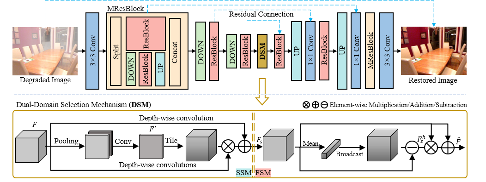

# Focal Network for Image Restoration

Yuning Cui, [Wenqi Ren](https://scholar.google.com.hk/citations?user=VwfgfR8AAAAJ&hl=zh-CN&oi=ao), [Xiaochun Cao](https://scholar.google.com.hk/citations?user=PDgp6OkAAAAJ&hl=zh-CN&oi=ao), [Alois Knoll](https://scholar.google.com.hk/citations?user=-CA8QgwAAAAJ&hl=zh-CN&oi=ao)

<!--  -->

>Image restoration aims to reconstruct a sharp image from its degraded counterpart, which plays an important role in many fields. Recently, Transformer models have achieved promising performance on various image restoration tasks. However, their quadratic complexity remains an intractable issue for practical applications. The aim of this study is to develop an efficient and effective framework for image restoration. Inspired by the fact that different regions in a corrupted image always undergo degradations in various degrees, we propose to focus more on the important areas for reconstruction. To this end, we introduce a dualdomain selection mechanism to emphasize crucial information for restoration, such as edge signals and hard regions. In addition, we split high-resolution features to insert multiscale receptive fields into the network, which improves both efficiency and performance. Finally, the proposed network, dubbed FocalNet, is built by incorporating these designs into a U-shaped backbone. Extensive experiments demonstrate that our model achieves state-of-the-art performance on ten datasets for three tasks, including single-image defocus deblurring, image dehazing, and image desnowing.

## Architecture

## Installation
The project is built with PyTorch 3.8, PyTorch 1.8.1. CUDA 10.2, cuDNN 7.6.5
For installing, follow these instructions:
~~~
conda install pytorch=1.8.1 torchvision=0.9.1 -c pytorch
pip install tensorboard einops scikit-image pytorch_msssim opencv-python
~~~
Install warmup scheduler:
~~~
cd pytorch-gradual-warmup-lr/
python setup.py install
cd ..
~~~
## Evaluation

<!-- ## Results -->

<!-- |Task|Dataset|PSNR|SSIM|Resulting Images|
|----|------|-----|----|------|
|**Motion Deblurring**|GoPro|33.27|0.963|[gdrive](https://drive.google.com/file/d/1mVerQce1ZZFkKOj0Cbwyj49ZPWdHcO2z/view?usp=sharing),[Baidu](https://pan.baidu.com/s/1ZVHjcpVeZBZU13npEgWCCg?pwd=7kqi)|
||HIDE|31.10|0.941|[gdrive](https://drive.google.com/file/d/1T1ZBg2gfqRCmhjvYD6qrgOdv9ZY0abHk/view?usp=sharing),[Baidu](https://pan.baidu.com/s/1GqGs_oGUbupQ1kSaMmSVGw?pwd=vu68)|
||RSBlur|34.35|0.872|[gdrive](https://drive.google.com/file/d/1-3IO7dOfhkH-rQVudxhRSMI59LfLXdH4/view?usp=sharing),[Baidu](https://pan.baidu.com/s/1HqP4gkRxCPxu8vYmdqWvEg?pwd=bfhh)|
|**Image Dehazing**|SOTS-Indoor|41.24|0.996|[gdrive](https://drive.google.com/file/d/1d-IMbzp3N42dEP1IN-VphAT2Ok2dTH90/view?usp=sharing),[Baidu](https://pan.baidu.com/s/1ewi9VLbGnmDbQDyLeXgpuQ?pwd=occl)|
||SOTS-Outdoor|40.05|0.996|[gdrive](https://drive.google.com/file/d/1m_FTpMYBZBqN76VtEkp2VEKA7WpIL0hO/view?usp=sharing),[Baidu](https://pan.baidu.com/s/10e-pIhxwB-Nt1uWCjmgJzw?pwd=07rl)|
||Dense-Haze|17.46|0.578|[gdrive](https://drive.google.com/file/d/1XfW0PzfxIEhI4GWMTvqOjxIsPE_syB0V/view?usp=sharing),[Baidu](https://pan.baidu.com/s/1AAsA5cKGz6tnIJMpeuU98A?pwd=d3nd)|
|**Image Desnowing**|CSD|38.41|0.99|[gdrive](https://drive.google.com/file/d/1zbqrLwCuvNjfOmER_mvBFbd7WGO9ciYH/view?usp=sharing),[Baidu](https://pan.baidu.com/s/1rM4ybZzXu62Ei7EzKYLWOg?pwd=mwql)|
||SRRS|32.40|0.98|[gdrive](https://drive.google.com/file/d/1XbjtHg5frKTDtoAabCHdPRGV37_WJ_2C/view?usp=sharing),[Baidu](https://pan.baidu.com/s/1-Z6aL4OPB5bYAX4PK7Xkdg?pwd=5vwc)|
||Snow100K|33.79|0.95|[gdrive](https://drive.google.com/file/d/17MQpMn02-l2duiB4t6PEHDTahIeJgsKU/view?usp=sharing),[Baidu](https://pan.baidu.com/s/1cx65WtJFk5Pgf1Os5x_RPQ?pwd=cftv)|
|**Image Deraining**|Average|33.56|0.929|[gdrive](https://drive.google.com/file/d/1QSSXEMs7Mc6U8e0rYpK7ik99Vs1RfojF/view?usp=sharing),[Baidu](https://pan.baidu.com/s/1IYdzzQlFX6ubTBga7EeGtA?pwd=jaa5)|
|**Defocus Deblurring**|DPDD*single*|26.23|0.811|[gdrive](https://drive.google.com/file/d/15ep5U--RRRPOwzb0rkd61NHz_8_poXDz/view?usp=sharing),[Baidu](https://pan.baidu.com/s/1jaDr4bY3FzoESsRgHjlJGw?pwd=95gn)|
||DPDD*dual*|26.34|0.817|[gdrive](https://drive.google.com/file/d/10EvKjAtbVdwoPCPALQNnEKfy3ele79SK/view?usp=sharing),[Baidu](https://pan.baidu.com/s/1x6ngjYKtktg5jHSqF-4Y3Q?pwd=zc65)| -->

## Results
The resulting images can be downloaded [here](https://drive.google.com/drive/folders/1GWgeqDuqJmR_3wy985l6Jl_ExtC3uFI_?usp=sharing).
|Task|Dataset|PSNR|SSIM|
|----|------|-----|----|
|**Image Dehazing**|ITS|40.82|0.96|
||OTS|37.71|0.995|
||Dense-Haze|17.07|0.63|
||NH-HAZE|20.43|0.79|
||O-HAZE|25.50|0.94|
||NHR|25.35|0.969|
|**Image Desnowing**|CSD|37.18|0.99|
||SRRS|31.34|0.98|
||Snow100K|33.53|0.95|
|**Defocus Deblurring||DPDD26.18|0.808|

## Citation
If you find this project useful for your research, please consider citing:
~~~
@inproceedings{cui2023focalnet,
  title={Focal Network for Image Restoration},
  author={Cui, Yuning and Ren, Wenqi and Cao, Xiaochun and Knoll, Alois},
  booktitle={Proceedings of the IEEE/CVF International Conference on Computer Vision (ICCV)},
  year={2023}
}
~~~
## Contact
Should you have any question, please contact Yuning Cui.